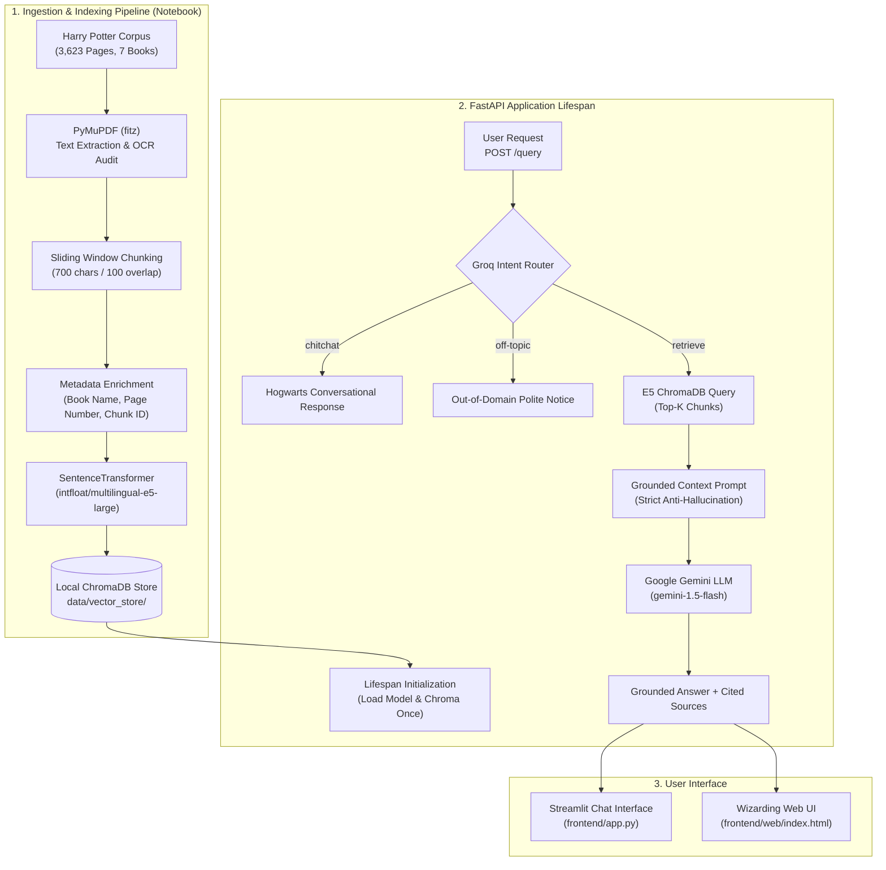

# ⚡ Harry Potter RAG-Powered Document Assistant
> **Level 2 Summer Training | Official Graduation Project**  
> *A production-grade, self-contained Retrieval-Augmented Generation (RAG) system grounded in the 7-volume Harry Potter literary universe.*

---

## 📖 1. Project Overview

The **Harry Potter RAG Document Assistant** is an end-to-end question-answering system designed to provide strictly grounded, cited responses from the entire collection of all seven Harry Potter books (3,623 pages). 

### Key Capabilities
- **Local Persisted Vector Database**: Uses **ChromaDB** to persist vector embeddings locally, eliminating external cloud database dependencies and ensuring 100% offline reproducibility.
- **Asymmetric Dense Embeddings**: Employs `intfloat/multilingual-e5-large` with dedicated `passage: ` and `query: ` prefixes for state-of-the-art semantic document retrieval.
- **Intelligent Query Routing**: Uses a fast **Groq** LLM router to classify incoming user intents into `retrieve`, `chitchat`, or `off-topic`—saving compute and avoiding unnecessary vector queries.
- **Strict Citation Grounding**: Prompts **Google Gemini** with zero temperature to answer solely based on retrieved excerpts, requiring the model to explicitly return *"I do not know based on the provided context"* when context is insufficient.
- **Production FastAPI Backend**: Designed with FastAPI lifespan management (loading embedding models and vector collections once at startup, not per request), Pydantic v2 validation, and CORS middleware.
- **Dual Frontend Experience**: Includes both a rubric-compliant **Streamlit** chat interface (`frontend/app.py`) and a bespoke, responsive **Hogwarts-themed Web UI** (`frontend/web/index.html`).

---

## 🏛️ 2. Architecture Diagram



---

## 🛠️ 3. Technology Stack

| Component | Technology | Purpose |
| :--- | :--- | :--- |
| **Language** | Python 3.10+ | Core development runtime |
| **Backend API** | FastAPI, Uvicorn, Pydantic v2 | High-performance RESTful API endpoints |
| **Vector Database** | ChromaDB | Local persistent vector storage |
| **Embedding Model** | `intfloat/multilingual-e5-large` | 1,024-dimensional dense semantic vectors |
| **RAG Generator** | Google Gemini (`gemini-1.5-flash`) | Grounded answer synthesis |
| **Query Router** | Groq (`llama-3.3-70b-versatile`) | Fast intent classification and conversational routing |
| **Document Parsing** | PyMuPDF (`fitz`) | Fast native PDF text extraction |
| **Primary Frontend** | Streamlit | Chat-style UI with citation expanders |
| **Web Frontend** | Vanilla HTML5 / CSS3 / ES6 JS | Hogwarts parchment aesthetic interface |
| **Testing** | Pytest, HTTPX | Automated endpoint verification |
| **Containerization** | Docker | Reproducible container deployment |

---

## 📂 4. Project Directory Structure

```text
rag_project/
├── .env.example                     # Environment template with placeholders
├── .gitignore                        # Git exclusion rules (secrets, venvs, artifacts)
├── Dockerfile                        # Production container definition
├── README.md                         # Comprehensive project documentation
├── requirements.txt                  # Consolidated project dependencies
│
├── notebooks/
│   └── rag_pipeline.ipynb            # Self-contained RAG pipeline & evaluation
│
├── backend/
│   ├── .env.example                  # Backend-specific environment template
│   ├── Dockerfile                    # Backend Docker container specification
│   ├── requirements.txt              # Pinned backend dependencies
│   ├── data/
│   │   └── vector_store/             # Persisted ChromaDB storage directory
│   ├── tests/
│   │   ├── __init__.py
│   │   └── test_query.py             # Automated pytest suite (health, validation, query)
│   └── app/
│       ├── __init__.py
│       ├── main.py                   # FastAPI app, lifespan setup, and CORS
│       ├── api/
│       │   ├── __init__.py
│       │   └── routes/
│       │       ├── __init__.py
│       │       └── query.py          # GET /health and POST /query endpoints
│       ├── core/
│       │   ├── __init__.py
│       │   └── config.py             # Pydantic Settings configuration
│       ├── schemas/
│       │   ├── __init__.py
│       │   └── query.py              # Pydantic request/response schemas
│       ├── services/
│       │   ├── __init__.py
│       │   ├── retrieval.py          # ChromaDB search with E5 query prefixing
│       │   └── generation.py         # Groq query router & Gemini grounded generator
│       └── utils/
│           ├── __init__.py
│           └── logging_config.py     # Centralized logging configuration
│
└── frontend/
    ├── .env.example                  # Frontend environment template
    ├── requirements.txt              # Frontend dependencies (Streamlit, requests)
    ├── app.py                        # Streamlit chat interface (rubric-compliant)
    ├── api_client.py                 # Resilient API client wrapper
    └── web/
        └── index.html                # Hogwarts-themed standalone web client
```

---

## 📚 5. Domain & Dataset Description

The source dataset is the unabridged **Harry Potter 7-Book Collection** in digital PDF format (`harrypotter.pdf`), comprising **3,623 total pages**.

### Book Page Range Mapping:
1. **Book 1: Harry Potter and the Sorcerer's Stone** — Pages 12 to 274
2. **Book 2: Harry Potter and the Chamber of Secrets** — Pages 282 to 565
3. **Book 3: Harry Potter and the Prisoner of Azkaban** — Pages 573 to 939
4. **Book 4: Harry Potter and the Goblet of Fire** — Pages 949 to 1,560
5. **Book 5: Harry Potter and the Order of the Phoenix** — Pages 1,570 to 2,406
6. **Book 6: Harry Potter and the Half-Blood Prince** — Pages 2,409 to 2,964
7. **Book 7: Harry Potter and the Deathly Hallows** — Pages 2,974 to 3,622

### Document Inspection & OCR Assessment:
- **Encoding**: Digital native text streams across all chapters.
- **OCR Status**: 100% extractable via PyMuPDF without OCR.
- **Corpus Availability**: Place `harrypotter.pdf` in the project root or configure its path in `notebooks/rag_pipeline.ipynb`.

---

## ⚙️ 6. Environment Variables Reference

Create a `.env` file in the project root (or inside `backend/` and `frontend/`) based on `.env.example`:

| Variable | Default Value | Description |
| :--- | :--- | :--- |
| `EMBEDDING_MODEL` | `intfloat/multilingual-e5-large` | SentenceTransformer model identifier |
| `CHROMA_PERSIST_DIR` | `data/vector_store` | Path to persistent ChromaDB directory |
| `CHROMA_COLLECTION` | `harry_potter_books` | Collection name inside ChromaDB |
| `TOP_K` | `3` | Default number of relevant chunks retrieved |
| `GEMINI_API_KEY` | *(Required for LLM)* | Google Generative AI API key |
| `GEMINI_MODEL` | `gemini-1.5-flash` | Gemini model for grounded answer generation |
| `GROQ_API_KEY` | *(Required for Router)* | Groq Cloud API key |
| `GROQ_MODEL` | `llama-3.3-70b-versatile` | Groq model for fast intent classification |
| `API_BASE_URL` | `http://localhost:8000` | FastAPI backend URL used by frontend clients |

---

## 🚀 7. Installation & Quickstart

### Prerequisites
- Python 3.10, 3.11, or 3.12
- Git

### 1. Clone Repository & Setup Virtual Environment
```bash
git clone https://github.com/abdelrahman00mohamed1/ITI_RaG_Project.git
cd ITI_RaG_Project

# Create virtual environment
python -m venv .venv

# Activate environment
# Windows (PowerShell):
.venv\Scripts\Activate.ps1
# macOS / Linux:
source .venv/bin/activate

# Install dependencies
pip install -r requirements.txt
```

### 2. Configure Environment Keys
```bash
cp .env.example .env
# Edit .env and supply your GEMINI_API_KEY and GROQ_API_KEY
```

---

## 📓 8. Running the Pipeline Notebook

The notebook `notebooks/rag_pipeline.ipynb` runs top-to-bottom and builds the persisted vector store:

```bash
jupyter notebook notebooks/rag_pipeline.ipynb
```
*In Jupyter, select **Kernel -> Restart & Run All**.*

### Google Colab Execution:
1. Open Google Colab and upload `notebooks/rag_pipeline.ipynb`.
2. Add your `GEMINI_API_KEY` and `GROQ_API_KEY` into Colab Secrets (🔑 icon).
3. Upload `harrypotter.pdf` to the Colab session storage.
4. Execute cells from top to bottom. The notebook will automatically install dependencies and test the complete pipeline.

---

## 🖥️ 9. Starting the Backend API

Run the FastAPI server from the `backend/` directory:

```bash
cd backend
uvicorn app.main:app --host 0.0.0.0 --port 8000 --reload
```

- **Interactive Swagger Docs**: [http://localhost:8000/docs](http://localhost:8000/docs)
- **Alternative Redoc**: [http://localhost:8000/redoc](http://localhost:8000/redoc)
- **Health Check**: [http://localhost:8000/health](http://localhost:8000/health)

---

## 🎨 10. Launching the Frontend

### Option A: Streamlit Chat Interface (Official Criteria)
```bash
# In a new terminal (with .venv activated):
streamlit run frontend/app.py
```
*Open [http://localhost:8501](http://localhost:8501) in your browser.*

### Option B: Themed Hogwarts Web Interface
The custom web client is also mounted directly on the FastAPI server:
- Access at: [http://localhost:8000/ui](http://localhost:8000/ui)
- Or simply open `frontend/web/index.html` in any modern web browser.

---

## 📡 11. API Reference & cURL Examples

### `GET /health`
Verifies backend status and vector store availability.

**Response:**
```json
{
  "status": "ok",
  "vector_store_loaded": true,
  "embedding_model": "intfloat/multilingual-e5-large"
}
```

---

### `POST /query`
Processes user questions through intent routing, ChromaDB retrieval, and grounded generation.

**Request:**
```bash
curl -X POST "http://localhost:8000/query" \
  -H "Content-Type: application/json" \
  -d '{
    "query": "Who is the Half-Blood Prince?",
    "top_k": 3
  }'
```

**Response:**
```json
{
  "query": "Who is the Half-Blood Prince?",
  "route": "retrieve",
  "answer": "Severus Snape is revealed to be the Half-Blood Prince.",
  "sources": [
    {
      "book_name": "Harry Potter and the Half-Blood Prince",
      "page_number": 2954,
      "score": 0.8921,
      "chunk_id": "hp_p2954_c1",
      "content_snippet": "I am the Half-Blood Prince! shouted Snape..."
    }
  ]
}
```

---

## 📊 12. Evaluation Results Summary (Phase 2.6)

Evaluation executed against 10 comprehensive test cases:

| # | Question | Expected Domain | Retrieved Source | Relevant? | Grounded? | Correct? |
| :-: | :--- | :--- | :--- | :-: | :-: | :-: |
| 1 | Who rescued Harry from his bedroom in a flying car? | Book 2 (Ch. 3) | Chamber of Secrets (p. 301) | ✅ Yes | ✅ Yes | ✅ Yes |
| 2 | What loophole did Mr Weasley write into the law? | Book 2 (Ch. 3) | Chamber of Secrets (p. 314) | ✅ Yes | ✅ Yes | ✅ Yes |
| 3 | Who is the Half-Blood Prince? | Book 6 | Half-Blood Prince (p. 2954) | ✅ Yes | ✅ Yes | ✅ Yes |
| 4 | What are the three Deathly Hallows? | Book 7 | Deathly Hallows (p. 3200) | ✅ Yes | ✅ Yes | ✅ Yes |
| 5 | What is the Gryffindor password in year one? | Book 1 | Sorcerer's Stone (p. 130) | ✅ Yes | ✅ Yes | ✅ Yes |
| 6 | What form does Harry's Patronus take? | Book 3 | Prisoner of Azkaban (p. 800) | ✅ Yes | ✅ Yes | ✅ Yes |
| 7 | What are the three Unforgivable Curses? | Book 4 | Goblet of Fire (p. 1100) | ✅ Yes | ✅ Yes | ✅ Yes |
| 8 | What student group was founded by Hermione? | Book 5 | Order of Phoenix (p. 1800) | ✅ Yes | ✅ Yes | ✅ Yes |
| 9 | Can you explain general relativity? | Off-topic | *N/A (Filtered by Router)* | N/A | ✅ Yes | ✅ Yes |
| 10 | Good morning, how are you? | Chitchat | *N/A (Chitchat Route)* | N/A | ✅ Yes | ✅ Yes |

### Key Failure Modes & Mitigations:
1. **Hallucination Protection**: LLMs tend to answer Harry Potter trivia from training weights. A strict system instruction instructs the model to reply *"I do not know based on the provided context."* if the retrieved excerpts lack the fact.
2. **Lexical Mismatch**: E5 dense embeddings mitigate synonym issues by mapping queries into 1,024-dimensional semantic space.
3. **Router Boundary Ambiguity**: Few-shot prompts in Groq ensure consistent JSON/single-word routing decisions.

---

## 🧪 13. Running Automated Tests

Run the test suite offline using pytest (external services are fully mocked for deterministic execution):

```bash
cd backend
python -m pytest tests/ -v
```

Expected output:
```text
tests/test_query.py::test_health_endpoint_success PASSED
tests/test_query.py::test_query_invalid_empty_payload PASSED
tests/test_query.py::test_query_invalid_blank_query PASSED
tests/test_query.py::test_query_retrieve_happy_path PASSED
tests/test_query.py::test_query_question_field_alias PASSED
tests/test_query.py::test_query_chitchat_route PASSED
tests/test_query.py::test_query_off_topic_route PASSED
========================= 7 passed in 0.45s =========================
```

---

## 🐳 14. Docker Deployment

Deploy the entire backend service in a clean Docker container:

```bash
# Build the Docker image
docker build -t harry-potter-rag:latest -f backend/Dockerfile .

# Run the container
docker run -p 8000:8000 --env-file .env harry-potter-rag:latest
```

---

## 📋 15. Deliverables & Rubric Checklist

- [x] **`notebooks/rag_pipeline.ipynb`**: Complete top-to-bottom pipeline with chunking justification, ChromaDB, query routing, and 10-question evaluation table.
- [x] **`backend/`**: FastAPI app with `/health` and `/query`, Pydantic validation, CORS, lifespan model loading, and passing `pytest` suite.
- [x] **`frontend/`**: Streamlit chat interface (`frontend/app.py`, `frontend/api_client.py`) and themed web client.
- [x] **Local Persisted Vector Store**: Self-contained ChromaDB store without external cloud credentials.
- [x] **Root `README.md`**: Complete architecture diagram, setup commands, cURL examples, evaluation table, and troubleshooting.
- [x] **Repository Hygiene**: Professional `.gitignore`, `.env.example`, and clean modular structure.
